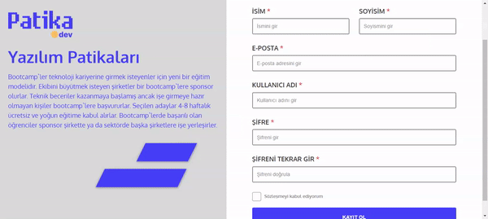

# week5-assignment

Arkadaşlar Merhaba 
- Sadece register ekranını yapacaksınız.
- Bu ekranları dark-light modlarını yapacaksınız
- Responsive istemiyorum sadece fullhd de düzenli görünmesi yeterli
- Scroll olması durumunda sadece sağ kısım scroll olacak
- Herhangi bir yere istek atmayacak. Yani gerçekte bir kayıp işlemi yapmayacaksınız
7- Formik ve yup yapılarını kullanmalısınız
- Hata mesajları tasarıımdaki gibi kullanmalısınız.

https://www.figma.com/file/16dhZthZnxdfg8ibsxE6ja/Login%2FRegister?node-id=0%3A1
 
### 🔗 [**Live Demo**](https://react-formik-validation.netlify.app)

 

